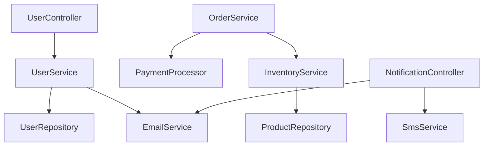
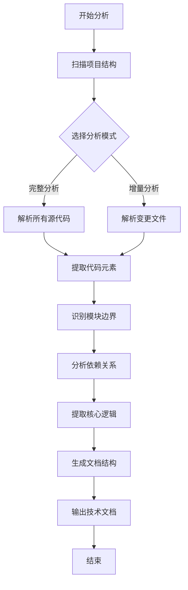

# 源代码结构梳理与技术文档生成技能

## 概述

本技能用于系统性地分析项目源代码，自动生成全面的技术文档。技能能够识别代码结构、模块划分、依赖关系和核心实现逻辑，生成符合行业标准格式的技术文档，便于开发人员理解、维护和二次开发。

---

# 核心功能

## 源代码解析能力

### 支持的编程语言

| 编程语言 | 文件扩展名 | 解析能力 |
|---------|-----------|---------|
| Python | .py, .pyi | 完整AST解析、类/函数提取、类型注解 |
| JavaScript/TypeScript | .js, .jsx, .ts, .tsx | ES6+语法、泛型、装饰器 |
| Java | .java | 面向对象结构、泛型、注解 |
| C/C++ | .c, .cpp, .h, .hpp | 模板、命名空间、继承体系 |
| C# | .cs | 属性、事件、委托、LINQ |
| Go | .go | 接口、结构体、goroutine |
| Rust | .rs | trait、生命周期、宏 |
| PHP | .php | 类、接口、trait |
| Ruby | .rb | 类、模块、mixin |
| Shell | .sh, .bash | 函数、变量、控制结构 |

### 代码元素提取

#### 结构元素

| 元素类型 | 提取信息 | 说明 |
|---------|---------|------|
| 类/结构体 | 名称、继承关系、实现接口、属性、方法列表 | 面向对象分析 |
| 函数/方法 | 名称、参数列表、返回值、访问修饰符 | 接口定义 |
| 变量/字段 | 名称、类型、初始值、访问级别 | 数据结构 |
| 接口/协议 | 方法列表、继承关系 | 抽象定义 |
| 模块/命名空间 | 包含的元素、导出列表 | 代码组织 |
| 枚举 | 枚举值、底层类型 | 常量定义 |

#### 注释文档

| 类型 | 格式 | 提取内容 |
|-----|------|---------|
| 文档字符串 | """...""" 或 '''...''' | Python函数/类说明 |
| Javadoc | /**...*/ | Java函数/类说明 |
| Doxygen | /**...*/ 或 /// | C/C++文档 |
| TSDoc | /**...*/ | TypeScript文档 |
| 行内注释 | // 或 # | 代码意图说明 |

## 模块识别能力

### 分类维度

#### 按业务功能分类

```markdown
project/
├── src/
│   ├── user-management/          # 用户管理模块
│   │   ├── User.java
│   │   ├── UserService.java
│   │   ├── UserRepository.java
│   │   └── UserController.java
│   ├── order-processing/         # 订单处理模块
│   │   ├── Order.java
│   │   ├── OrderService.java
│   │   ├── PaymentProcessor.java
│   │   └── OrderController.java
│   ├── inventory/                # 库存管理模块
│   │   ├── Product.java
│   │   ├── InventoryService.java
│   │   └── StockManager.java
│   └── notification/             # 通知服务模块
│       ├── EmailService.java
│       ├── SmsService.java
│       └── NotificationController.java
```

#### 按技术层次分类

```markdown
project/
├── src/
│   ├── presentation/             # 表现层
│   │   ├── controllers/
│   │   ├── views/
│   │   └── handlers/
│   ├── application/              # 应用层
│   │   ├── services/
│   │   ├── use_cases/
│   │   └── facades/
│   ├── domain/                   # 领域层
│   │   ├── entities/
│   │   ├── value_objects/
│   │   ├── aggregates/
│   │   └── domain_services/
│   ├── infrastructure/           # 基础设施层
│   │   ├── repositories/
│   │   ├── data_access/
│   │   └── external_services/
│   └── common/                   # 公共模块
│       ├── utilities/
│       ├── exceptions/
│       └── constants/
```

### 模块特征识别

```python
def identify_module_features(file_path, content):
    """
    识别模块特征
    
    分析文件内容，提取模块的关键特征：
    - 主要功能描述
    - 核心类/函数
    - 依赖关系
    - 对外接口
    """
    features = {
        'primary_class': None,           # 主类名称
        'core_functions': [],            # 核心功能函数
        'public_methods': [],            # 公共方法
        'external_dependencies': [],     # 外部依赖
        'module_responsibility': '',     # 模块职责
        'configuration_items': []        # 配置项
    }
    
    # 分析AST提取结构
    tree = ast.parse(content)
    for node in ast.walk(tree):
        if isinstance(node, ast.ClassDef):
            features['primary_class'] = node.name
        elif isinstance(node, ast.FunctionDef):
            if node.name.startswith(('_', '__')) == False:
                features['core_functions'].append(node.name)
    
    return features
```

## 依赖关系分析

### 依赖类型

| 依赖类型 | 说明 | 分析方法 |
|---------|------|---------|
| 导入依赖 | import语句 | 分析导入语句 |
| 继承依赖 | 类继承关系 | 分析extends/implements |
| 引用依赖 | 函数调用 | 分析调用关系 |
| 配置依赖 | 配置文件 | 分析配置引用 |
| 数据依赖 | 数据库操作 | 分析ORM映射 |

### 依赖图生成

```python
class DependencyAnalyzer:
    """依赖关系分析器"""
    
    def __init__(self):
        self.modules = {}          # 模块列表
        self.dependencies = []     # 依赖关系列表
        self.call_graph = {}       # 调用图
        
    def analyze_project(self, project_path):
        """
        分析项目依赖
        
        步骤：
        1. 扫描所有源代码文件
        2. 提取导入和引用关系
        3. 构建模块依赖图
        4. 识别循环依赖
        """
        # 扫描文件
        source_files = self._scan_source_files(project_path)
        
        # 提取依赖
        for file in source_files:
            module_deps = self._extract_dependencies(file)
            self.modules[file.module_name] = module_deps
        
        # 构建依赖图
        self._build_dependency_graph()
        
        # 检测循环依赖
        cycles = self._detect_cycles()
        if cycles:
            logger.warning(f"发现循环依赖: {cycles}")
        
        return self.modules, self.dependencies
    
    def _build_dependency_graph(self):
        """构建模块依赖图"""
        for module_name, module_info in self.modules.items():
            for dep in module_info.dependencies:
                if dep in self.modules:
                    self.dependencies.append({
                        'from': module_name,
                        'to': dep,
                        'type': 'import'
                    })
```

### 依赖可视化



## 核心逻辑提取

### 算法提取

```python
def extract_core_algorithms(file_path, content):
    """
    提取核心算法
    
    识别标准：
    - 函数复杂度（圈复杂度）
    - 代码行数
    - 嵌套深度
    - 循环结构
    """
    algorithms = []
    tree = ast.parse(content)
    
    for node in ast.walk(tree):
        if isinstance(node, ast.FunctionDef):
            metrics = self._calculate_complexity(node)
            
            if metrics['cyclomatic_complexity'] > 10 or \
               metrics['lines_of_code'] > 50:
                algorithms.append({
                    'name': node.name,
                    'complexity': metrics['cyclomatic_complexity'],
                    'lines': metrics['lines_of_code'],
                    'description': self._extract_docstring(node),
                    'logic_flow': self._extract_logic_flow(node)
                })
    
    return algorithms

def _calculate_complexity(self, node):
    """计算代码复杂度"""
    complexity = 1
    for child in ast.walk(node):
        if isinstance(child, (ast.If, ast.For, ast.While, ast.Assert,
                             ast.With, ast.Try, ast.ExceptHandler)):
            complexity += 1
    
    return {
        'cyclomatic_complexity': complexity,
        'lines_of_code': node.end_lineno - node.lineno + 1,
        'max_nesting': self._max_nesting_depth(node)
    }
```

### 数据流程提取

```python
def extract_data_flow(file_path, content):
    """
    提取数据流程
    
    分析数据在函数中的流转：
    - 输入参数
    - 内部变量
    - 返回值
    - 外部调用
    """
    data_flow = {
        'inputs': [],      # 输入数据
        'outputs': [],     # 输出数据
        'transformations': [],  # 数据转换
        'side_effects': []      # 副作用
    }
    
    tree = ast.parse(content)
    
    for node in ast.walk(tree):
        if isinstance(node, ast.FunctionDef):
            # 提取输入参数
            for arg in node.args.args:
                data_flow['inputs'].append({
                    'name': arg.arg,
                    'type': self._infer_type(arg.annotation)
                })
            
            # 提取返回值
            returns = self._extract_returns(node)
            data_flow['outputs'].extend(returns)
    
    return data_flow
```

---

# 使用场景

## 场景一：新项目接手

当开发人员需要快速理解新接手项目时：

```markdown
请分析这个项目的源代码结构，生成技术文档
```

**处理流程**：
1. 扫描项目整体结构
2. 识别模块划分
3. 分析依赖关系
4. 提取核心逻辑
5. 生成完整文档

**输出**：
- 项目整体架构图
- 模块说明文档
- API参考手册
- 数据流程图

## 场景二：代码审查准备

当需要进行代码审查时：

```markdown
生成一个用于代码审查的技术文档
```

**处理流程**：
1. 分析代码质量指标
2. 识别潜在问题
3. 提取复杂算法
4. 生成审查要点

**输出**：
- 代码质量报告
- 风险点识别
- 重构建议

## 场景三：接口文档生成

当需要生成API接口文档时：

```markdown
提取所有API接口并生成文档
```

**处理流程**：
1. 识别控制器/处理器
2. 提取路由定义
3. 分析参数和返回值
4. 生成接口文档

**输出**：
- 接口列表
- 参数说明
- 请求示例
- 响应示例

## 场景四：遗留系统文档

当需要为遗留系统补充文档时：

```markdown
为这个遗留项目生成技术文档
```

**处理流程**：
1. 全面扫描代码
2. 逆向分析设计
3. 提取业务规则
4. 补充文档说明

**输出**：
- 系统架构文档
- 功能说明
- 数据字典
- 部署指南

---

# 工作流程

## 整体处理流程



## 第一阶段：项目扫描

### 1.1 文件系统扫描

```python
class ProjectScanner:
    """项目扫描器"""
    
    def scan_project(self, project_path, config=None):
        """
        扫描项目结构
        
        输出：
        - 文件列表
        - 目录结构
        - 配置文件
        - 入口文件
        """
        result = {
            'file_tree': {},           # 文件树结构
            'source_files': [],        # 源文件列表
            'config_files': [],        # 配置文件
            'test_files': [],          # 测试文件
            'documentation_files': [], # 文档文件
            'entry_points': []         # 入口点
        }
        
        # 扫描目录
        for root, dirs, files in os.walk(project_path):
            # 排除不需要的目录
            dirs[:] = [d for d in dirs if d not in self.EXCLUDE_DIRS]
            
            # 处理文件
            for file in files:
                file_path = os.path.join(root, file)
                file_info = self._analyze_file(file_path)
                
                # 分类文件
                if self._is_source_file(file):
                    result['source_files'].append(file_info)
                elif self._is_config_file(file):
                    result['config_files'].append(file_info)
                elif self._is_test_file(file):
                    result['test_files'].append(file_info)
                elif self._is_doc_file(file):
                    result['documentation_files'].append(file_info)
        
        # 构建文件树
        result['file_tree'] = self._build_file_tree(result['source_files'])
        
        # 识别入口点
        result['entry_points'] = self._identify_entry_points(result)
        
        return result
```

### 1.2 项目结构分析

```python
class ProjectStructureAnalyzer:
    """项目结构分析器"""
    
    def analyze_structure(self, scan_result):
        """
        分析项目结构特征
        
        分析维度：
        - 项目类型（库、应用、框架）
        - 技术栈
        - 架构模式
        - 规模指标
        """
        structure_info = {
            'project_type': None,      # 项目类型
            'architecture_pattern': None,  # 架构模式
            'tech_stack': [],          # 技术栈
            'scale_metrics': {         # 规模指标
                'total_files': 0,
                'total_lines': 0,
                'total_classes': 0,
                'total_functions': 0
            },
            'organization_pattern': None  # 组织模式
        }
        
        # 判断项目类型
        structure_info['project_type'] = self._detect_project_type(scan_result)
        
        # 检测技术栈
        structure_info['tech_stack'] = self._detect_tech_stack(scan_result)
        
        # 分析架构模式
        structure_info['architecture_pattern'] = self._detect_architecture(scan_result)
        
        # 计算规模指标
        structure_info['scale_metrics'] = self._calculate_metrics(scan_result)
        
        return structure_info
```

## 第二阶段：代码解析

### 2.1 抽象语法树解析

```python
class ASTParser:
    """抽象语法树解析器"""
    
    def __init__(self):
        self.parsers = {
            'python': PythonASTParser(),
            'javascript': JavaScriptASTParser(),
            'java': JavaASTParser(),
            'typescript': TypeScriptASTParser(),
        }
    
    def parse(self, file_path, content, language):
        """
        解析源代码为AST
        
        输出：
        - 类定义列表
        - 函数定义列表
        - 变量定义列表
        - 导入列表
        - 注释列表
        """
        parser = self.parsers.get(language)
        if not parser:
            logger.warning(f"不支持的语言: {language}")
            return None
        
        try:
            ast_tree = parser.parse(content)
            
            result = {
                'classes': [],          # 类定义
                'functions': [],        # 函数定义
                'variables': [],        # 变量定义
                'imports': [],          # 导入语句
                'comments': [],         # 注释
                'metadata': {}          # 元数据
            }
            
            # 提取各类元素
            self._extract_classes(ast_tree, result)
            self._extract_functions(ast_tree, result)
            self._extract_variables(ast_tree, result)
            self._extract_imports(ast_tree, result)
            self._extract_comments(content, result)
            
            # 添加文件元数据
            result['metadata'] = {
                'file_path': file_path,
                'language': language,
                'total_lines': len(content.splitlines()),
                'code_lines': self._count_code_lines(content)
            }
            
            return result
            
        except Exception as e:
            logger.error(f"解析失败 {file_path}: {e}")
            return None
```

### 2.2 代码元素提取

```python
class CodeElementExtractor:
    """代码元素提取器"""
    
    def extract_all(self, ast_tree, language):
        """
        提取所有代码元素
        
        提取内容：
        - 类：名称、父类、接口、实现的方法
        - 函数：名称、参数、返回值、复杂度
        - 变量：名称、类型、初始值
        """
        elements = {
            'classes': [],
            'functions': [],
            'variables': [],
            'interfaces': [],
            'constants': [],
            'enums': []
        }
        
        # 根据语言选择提取策略
        extractors = {
            'python': self._extract_python_elements,
            'java': self._extract_java_elements,
            'javascript': self._extract_js_elements,
        }
        
        extractor = extractors.get(language, self._extract_default_elements)
        extractor(ast_tree, elements)
        
        return elements
    
    def _extract_python_elements(self, ast_tree, elements):
        """提取Python代码元素"""
        for node in ast.walk(ast_tree):
            # 提取类
            if isinstance(node, ast.ClassDef):
                class_info = {
                    'name': node.name,
                    'bases': [base.id for base in node.bases if isinstance(base, ast.Name)],
                    'methods': [],
                    'attributes': [],
                    'decorators': [d.id for d in node.decorator_list if isinstance(d, ast.Name)],
                    'docstring': ast.get_docstring(node),
                    'line_number': node.lineno
                }
                
                # 提取方法
                for item in node.body:
                    if isinstance(item, ast.FunctionDef):
                        class_info['methods'].append(self._extract_function_info(item))
                    elif isinstance(item, ast.Assign):
                        for target in item.targets:
                            if isinstance(target, ast.Name):
                                class_info['attributes'].append({
                                    'name': target.id,
                                    'line_number': item.lineno
                                })
                
                elements['classes'].append(class_info)
            
            # 提取函数
            elif isinstance(node, ast.FunctionDef) and not self._is_method(node):
                elements['functions'].append(self._extract_function_info(node))
            
            # 提取常量
            elif isinstance(node, ast.Assign) and len(node.targets) == 1:
                target = node.targets[0]
                if isinstance(target, ast.Name):
                    if target.id.isupper():
                        elements['constants'].append({
                            'name': target.id,
                            'value': self._get_value(node.value),
                            'line_number': node.lineno
                        })
```

## 第三阶段：模块识别

### 3.1 模块边界检测

```python
class ModuleDetector:
    """模块边界检测器"""
    
    def detect_modules(self, project_root, file_analysis_results):
        """
        检测模块边界
        
        检测方法：
        1. 目录结构分析
        2. 包/命名空间识别
        3. 入口点识别
        4. 导出列表分析
        """
        modules = {}
        
        # 方法1：基于目录结构
        dir_modules = self._detect_by_directory_structure(project_root)
        modules.update(dir_modules)
        
        # 方法2：基于包/命名空间
        pkg_modules = self._detect_by_package_namespace(file_analysis_results)
        modules.update(pkg_modules)
        
        # 合并和去重
        self._merge_modules(modules)
        
        return modules
    
    def _detect_by_directory_structure(self, project_root):
        """基于目录结构检测模块"""
        modules = {}
        
        # 识别可能的模块目录
        module_indicators = [
            '__init__.py',       # Python包
            'package.json',      # JavaScript包
            'pom.xml',           # Java项目
            'build.gradle',      # Java Gradle项目
            'mod.rs',            # Rust模块
            'go.mod',            # Go模块
        ]
        
        for root, dirs, files in os.walk(project_root):
            # 检查是否为模块目录
            for indicator in module_indicators:
                if indicator in files:
                    module_path = os.path.relpath(root, project_root)
                    module_name = self._path_to_module_name(module_path)
                    
                    modules[module_name] = {
                        'path': module_path,
                        'type': 'directory',
                        'files': [f for f in files if f.endswith('.py')],
                        'sub_modules': []
                    }
                    break
        
        return modules
```

### 3.2 模块功能标注

```python
class ModuleAnnotator:
    """模块功能标注器"""
    
    def annotate_modules(self, modules, file_analysis_results):
        """
        为模块添加功能标注
        
        标注内容：
        - 模块职责
        - 核心功能
        - 对外接口
        - 依赖关系
        """
        for module_name, module in modules.items():
            # 收集模块内所有文件的信息
            module_files = [f for f in file_analysis_results 
                          if self._file_in_module(f['path'], module)]
            
            # 分析模块功能
            module['responsibility'] = self._analyze_responsibility(module_files)
            module['core_features'] = self._extract_core_features(module_files)
            module['public_interfaces'] = self._extract_public_interfaces(module_files)
            module['dependencies'] = self._analyze_dependencies(module_files)
    
    def _analyze_responsibility(self, files):
        """
        分析模块职责
        
        分析方法：
        1. 主类/主函数分析
        2. 命名模式匹配
        3. 注释内容分析
        """
        responsibility = {
            'summary': '',           # 简要描述
            'detailed': '',          # 详细描述
            'keywords': [],          # 关键词
            'confidence': 0.0        # 置信度
        }
        
        # 收集所有类名和函数名
        class_names = []
        function_names = []
        for file in files:
            for cls in file.get('classes', []):
                class_names.append(cls['name'])
            for func in file.get('functions', []):
                function_names.append(func['name'])
        
        # 基于命名模式推断
        patterns = {
            'controller': '处理HTTP请求和响应',
            'service': '提供业务逻辑服务',
            'repository': '数据访问和存储',
            'manager': '管理和协调功能',
            'util': '提供工具函数',
            'handler': '处理特定事件或请求',
            'processor': '处理数据或任务',
            'builder': '构建复杂对象',
            'factory': '创建对象实例',
            'adapter': '适配不同接口',
            'strategy': '实现策略模式',
            'observer': '实现观察者模式'
        }
        
        keywords = []
        for name in class_names + function_names:
            name_lower = name.lower()
            for pattern, desc in patterns.items():
                if pattern in name_lower:
                    keywords.append((pattern, desc))
        
        if keywords:
            responsibility['keywords'] = keywords
            responsibility['summary'] = '、'.join([k[1] for k in keywords])
            responsibility['confidence'] = min(0.9, len(keywords) * 0.2 + 0.3)
        
        return responsibility
```

## 第四阶段：依赖分析

### 4.1 依赖图构建

```python
class DependencyGraphBuilder:
    """依赖图构建器"""
    
    def build_graph(self, modules, file_analysis_results):
        """
        构建依赖图
        
        输出：
        - 节点：模块/文件
        - 边：依赖关系
        - 属性：关系类型和强度
        """
        graph = {
            'nodes': [],             # 节点列表
            'edges': [],             # 边列表
            'metadata': {            # 图元数据
                'total_nodes': 0,
                'total_edges': 0,
                'cycles': []        # 循环依赖
            }
        }
        
        # 创建节点
        for module in modules.values():
            graph['nodes'].append({
                'id': module['name'],
                'label': module['name'],
                'type': 'module',
                'attributes': {
                    'file_count': len(module.get('files', [])),
                    'responsibility': module.get('responsibility', {}).get('summary', '')
                }
            })
        
        # 创建边（依赖关系）
        for module_name, module in modules.items():
            for dep in module.get('dependencies', []):
                if dep in modules:
                    edge = {
                        'source': module_name,
                        'target': dep,
                        'type': 'depends',
                        'strength': self._calculate_dependency_strength(
                            module, modules[dep]
                        )
                    }
                    graph['edges'].append(edge)
        
        # 统计
        graph['metadata']['total_nodes'] = len(graph['nodes'])
        graph['metadata']['total_edges'] = len(graph['edges'])
        
        # 检测循环依赖
        graph['metadata']['cycles'] = self._detect_cycles(graph)
        
        return graph
    
    def _calculate_dependency_strength(self, from_module, to_module):
        """
        计算依赖强度
        
        计算方法：
        1. 导入次数
        2. 调用次数
        3. 类型引用次数
        """
        strength = 0
        
        # 统计导入语句
        for file in from_module.get('files', []):
            if to_module['name'] in str(file.get('imports', [])):
                strength += 1
        
        return min(1.0, strength * 0.2)
```

### 4.2 依赖关系分析报告

```python
class DependencyReportGenerator:
    """依赖关系分析报告生成器"""
    
    def generate_report(self, dependency_graph):
        """
        生成依赖分析报告
        
        报告内容：
        1. 依赖概览
        2. 核心模块
        3. 依赖密集模块
        4. 循环依赖
        5. 改进建议
        """
        report = {
            'overview': self._generate_overview(dependency_graph),
            'core_modules': self._identify_core_modules(dependency_graph),
            'high_coupling_modules': self._identify_high_coupling(dependency_graph),
            'cycles': dependency_graph['metadata']['cycles'],
            'recommendations': self._generate_recommendations(dependency_graph)
        }
        
        return report
    
    def _identify_core_modules(self, graph):
        """
        识别核心模块
        
        核心模块特征：
        1. 被最多的其他模块依赖
        2. 依赖最多的其他模块
        3. 处于依赖链中心位置
        """
        # 计算入度和出度
        in_degree = {}
        out_degree = {}
        
        for node in graph['nodes']:
            node_id = node['id']
            in_degree[node_id] = 0
            out_degree[node_id] = 0
        
        for edge in graph['edges']:
            out_degree[edge['source']] += 1
            in_degree[edge['target']] += 1
        
        # 计算总度数
        total_degree = {}
        for node_id in in_degree:
            total_degree[node_id] = in_degree[node_id] + out_degree[node_id]
        
        # 排序并返回前N个核心模块
        sorted_modules = sorted(
            total_degree.items(),
            key=lambda x: x[1],
            reverse=True
        )
        
        return [
            {'module': module, 'degree': degree}
            for module, degree in sorted_modules[:5]
        ]
```

## 第五阶段：文档生成

### 5.1 文档结构规划

```python
class DocumentationStructurePlanner:
    """文档结构规划器"""
    
    def plan_structure(self, analysis_result):
        """
        规划文档结构
        
        生成结构：
        1. 概述
        2. 架构设计
        3. 模块说明
        4. 接口文档
        5. 数据字典
        6. 部署指南
        """
        structure = {
            'title': '技术设计文档',
            'sections': [],
            'toc': []               # 目录
        }
        
        # 添加概述章节
        structure['sections'].append(self._create_overview_section(analysis_result))
        structure['toc'].append({
            'id': 'overview',
            'title': '1 项目概述',
            'level': 1
        })
        
        # 添加架构章节
        structure['sections'].append(self._create_architecture_section(analysis_result))
        structure['toc'].append({
            'id': 'architecture',
            'title': '2 架构设计',
            'level': 1
        })
        
        # 添加模块章节
        module_section, module_toc = self._create_modules_section(analysis_result)
        structure['sections'].append(module_section)
        structure['toc'].extend(module_toc)
        
        # 添加接口章节
        api_section, api_toc = self._create_api_section(analysis_result)
        structure['sections'].append(api_section)
        structure['toc'].extend(api_toc)
        
        # 添加数据字典章节
        structure['sections'].append(self._create_data_dictionary_section(analysis_result))
        structure['toc'].append({
            'id': 'data-dictionary',
            'title': '数据字典',
            'level': 1
        })
        
        return structure
```

### 5.2 文档内容生成

```python
class DocumentationContentGenerator:
    """文档内容生成器"""
    
    def generate_documentation(self, analysis_result, output_format='markdown'):
        """
        生成技术文档
        
        支持格式：
        - Markdown：便于阅读和版本控制
        - HTML：在线浏览
        - PDF：正式文档
        - reStructuredText： Sphinx文档
        """
        # 根据输出格式选择生成器
        generators = {
            'markdown': MarkdownDocumentationGenerator(),
            'html': HTMLDocumentationGenerator(),
            'pdf': PDFDocumentationGenerator(),
            'rst': RSTDocumentationGenerator()
        }
        
        generator = generators.get(output_format)
        if not generator:
            raise ValueError(f"不支持的输出格式: {output_format}")
        
        # 生成文档
        content = generator.generate(analysis_result)
        
        return content
    
    def _generate_module_documentation(self, module, language='zh-CN'):
        """
        生成模块文档
        
        文档内容：
        1. 模块概述
        2. 核心类/函数
        3. 对外接口
        4. 依赖关系
        5. 使用示例
        """
        doc = f"""
## 模块：{module['name']}

### 概述
{module.get('responsibility', {}).get('summary', '暂无描述')}

### 详细说明
{module.get('responsibility', {}).get('detailed', '暂无详细说明')}

### 核心类
| 类名 | 职责 | 方法数 |
|------|------|--------|
"""
        
        for cls in module.get('classes', []):
            doc += f"| {cls['name']} | {cls.get('docstring', '')[:50]}... | {len(cls.get('methods', []))} |\n"
        
        doc += """
### 对外接口

"""
        
        for func in module.get('public_functions', []):
            doc += f"""#### {func['name']}

**功能描述**：{func.get('docstring', '暂无描述')}

**参数**：
"""
            for param in func.get('parameters', []):
                doc += f"- `{param['name']}` ({param['type']})：{param.get('description', '无描述')}\n"
            
            doc += f"""
**返回值**：{func.get('return_type', 'void')}

**使用示例**：
```python
# 示例代码
result = {func['name']}({', '.join([p['name'] for p in func.get('parameters', [])])})
```

"""
        
        return doc
```

---

# 配置选项

## 分析配置

### 扫描选项

```yaml
scan:
  # 排除的目录
  exclude_dirs:
    - node_modules
    - venv
    - __pycache__
    - .git
    - build
    - dist
    
  # 排除的文件模式
  exclude_patterns:
    - "*.min.js"
    - "*.bundle.js"
    - "*.generated.*"
    
  # 包含的文件模式
  include_patterns:
    - "*.py"
    - "*.js"
    - "*.ts"
    - "*.java"
    - "*.cpp"
```

### 解析选项

```yaml
parsing:
  # 语言特定配置
  languages:
    python:
      parse_ast: true
      extract_types: true
      parse_decorators: true
    javascript:
      parse_babel: false
      extract_types: true
      parse_jsx: true
    java:
      parse_spring_annotations: true
      extract_javadoc: true
      
  # 注释提取
  comments:
    extract_docstrings: true
    extract_inline_comments: true
    min_comment_length: 3
    
  # 代码元素
  elements:
    extract_classes: true
    extract_functions: true
    extract_variables: true
    extract_interfaces: true
```

### 输出配置

```yaml
output:
  # 文档格式
  format: markdown  # markdown, html, pdf, rst
  
  # 输出目录
  output_dir: ./docs
  
  # 文件命名
  file_name: "技术设计文档"
  
  # 模板选择
  template: standard  # simple, standard, detailed
  
  # 选项
  include_toc: true
  include_index: true
  include_examples: true
  generate_diagrams: true
  
  # 图表类型
  diagrams:
    architecture: true
    dependency: true
    class: true
    sequence: false
```

---

# 最佳实践

## 分析前准备

### 1. 项目清理

```bash
# 在分析前执行
# 清理构建产物
rm -rf build/ dist/ *.egg-info/

# 清理缓存
rm -rf .pytest_cache/ __pycache__/ node_modules/.cache/

# 确保代码已编译（如果需要）
npm run build
mvn compile
```

### 2. 环境配置

```bash
# 设置分析环境
# 安装依赖（用于类型分析）
pip install -r requirements-dev.txt
npm install --production=false

# 设置环境变量
export ANALYSIS_MODE=true
```

### 3. 配置文件

创建分析配置文件 `analyzer.yaml`：

```yaml
project:
  name: "MyProject"
  version: "1.0.0"
  root: "./src"

analysis:
  modules:
    - name: "core"
      paths:
        - "core/"
    - name: "api"
      paths:
        - "api/"
        
  ignore:
    - "**/test/**"
    - "**/*_test.py"
```

## 分析执行

### 1. 命令行使用

```bash
# 基本分析
python -m code_analyzer ./project -o ./docs

# 详细分析
python -m code_analyzer ./project \
    --format html \
    --template detailed \
    --include-diagrams \
    --output ./docs

# 自定义配置
python -m code_analyzer ./project \
    --config analyzer.yaml \
    --exclude "**/legacy/**"
```

### 2. 集成到CI/CD

```yaml
# .github/workflows/docs.yml
name: Generate Documentation

on:
  push:
    branches: [main]

jobs:
  docs:
    runs-on: ubuntu-latest
    steps:
      - uses: actions/checkout@v3
      
      - name: Set up Python
        uses: actions/setup-python@v4
        with:
          python-version: '3.10'
      
      - name: Install dependencies
        run: |
          pip install code-analyzer
          pip install -r requirements.txt
      
      - name: Generate documentation
        run: |
          code-analyzer . \
              --config .analyzer.yaml \
              --output ./docs
      
      - name: Deploy to GitHub Pages
        uses: peaceiris/actions-gh-pages@v3
        with:
          github_token: ${{ secrets.GITHUB_TOKEN }}
          publish_dir: ./docs
```

## 分析后验证

### 1. 文档完整性检查

```python
def check_documentation_completeness(doc_path):
    """
    检查文档完整性
    
    检查项目：
    1. 所有模块都有文档
    2. 所有公共接口都有说明
    3. 文档格式一致
    """
    checks = {
        'modules_documented': [],
        'apis_documented': [],
        'missing_documentation': [],
        'format_issues': []
    }
    
    # 检查模块文档
    modules = extract_module_list(doc_path)
    for module in modules:
        if not has_module_documentation(doc_path, module):
            checks['missing_documentation'].append({
                'type': 'module',
                'name': module
            })
    
    # 检查API文档
    apis = extract_api_list(doc_path)
    for api in apis:
        if not has_api_documentation(doc_path, api):
            checks['missing_documentation'].append({
                'type': 'api',
                'name': api
            })
    
    return checks
```

### 2. 与代码同步验证

```python
def verify_doc_code_sync(doc_path, project_path):
    """
    验证文档与代码同步
    
    检查内容：
    1. 文档中的类/函数是否在代码中存在
    2. 参数说明是否与代码一致
    3. 返回值说明是否正确
    """
    sync_issues = []
    
    # 提取文档中的引用
    doc_references = extract_references_from_doc(doc_path)
    
    # 验证每个引用
    for ref in doc_references:
        if not code_element_exists(project_path, ref):
            sync_issues.append({
                'reference': ref,
                'issue': '代码中不存在此元素'
            })
    
    return sync_issues
```

---

# 性能优化

## 大项目处理

### 1. 并行分析

```python
from concurrent.futures import ThreadPoolExecutor, ProcessPoolExecutor
import multiprocessing

class ParallelAnalyzer:
    """并行分析器"""
    
    def __init__(self, max_workers=None):
        self.max_workers = max_workers or multiprocessing.cpu_count()
    
    def analyze_files_parallel(self, file_list, analyzer):
        """
        并行分析文件列表
        
        使用进程池进行CPU密集型任务
        使用线程池进行IO密集型任务
        """
        results = {}
        
        # 使用进程池进行AST解析
        with ProcessPoolExecutor(max_workers=self.max_workers) as executor:
            future_to_file = {
                executor.submit(analyzer.parse_file, file): file
                for file in file_list
            }
            
            for future in concurrent.futures.as_completed(future_to_file):
                file = future_to_file[future]
                try:
                    result = future.result()
                    results[file] = result
                except Exception as e:
                    logger.error(f"分析失败 {file}: {e}")
        
        return results
```

### 2. 增量分析

```python
class IncrementalAnalyzer:
    """增量分析器"""
    
    def __init__(self, cache_dir='.analyzer_cache'):
        self.cache_dir = cache_dir
        os.makedirs(cache_dir, exist_ok=True)
        self.last_analysis = self._load_last_analysis()
    
    def analyze_changed_files(self, changed_files, full_analyzer):
        """
        只分析变更的文件
        
        步骤：
        1. 获取变更文件列表
        2. 检查缓存
        3. 只重新分析变更的文件
        4. 更新缓存
        """
        results = {}
        
        for file in changed_files:
            # 检查文件是否修改
            if self._is_file_modified(file):
                result = full_analyzer.parse_file(file)
                results[file] = result
                
                # 更新缓存
                self._update_cache(file, result)
            else:
                # 使用缓存
                results[file] = self._load_from_cache(file)
        
        return results
    
    def _is_file_modified(self, file_path):
        """检查文件是否修改"""
        cache_info = self._get_cache_info(file_path)
        if not cache_info:
            return True
        
        file_mtime = os.path.getmtime(file_path)
        return file_mtime > cache_info['mtime']
```

### 3. 缓存策略

```python
class AnalysisCache:
    """分析缓存"""
    
    def __init__(self, cache_dir='.analyzer_cache'):
        self.cache_dir = cache_dir
        self.memory_cache = {}  # 内存缓存
        
    def get(self, key):
        """获取缓存"""
        # 先查内存缓存
        if key in self.memory_cache:
            return self.memory_cache[key]
        
        # 再查磁盘缓存
        cache_path = self._get_cache_path(key)
        if os.path.exists(cache_path):
            with open(cache_path, 'rb') as f:
                data = pickle.load(f)
            self.memory_cache[key] = data
            return data
        
        return None
    
    def set(self, key, value, ttl=3600):
        """设置缓存"""
        # 写入内存缓存
        self.memory_cache[key] = value
        
        # 写入磁盘缓存
        cache_path = self._get_cache_path(key)
        with open(cache_path, 'wb') as f:
            pickle.dump({
                'value': value,
                'timestamp': time.time(),
                'ttl': ttl
            }, f)
```

---

# 错误处理

## 常见错误

### 文件解析错误

| 错误代码 | 错误描述 | 解决方案 |
|---------|---------|---------|
| P001 | 语法解析失败 | 检查代码语法 |
| P002 | 编码检测失败 | 指定文件编码 |
| P003 | 不支持的语言 | 添加语言支持 |
| P004 | 文件过大 | 使用增量解析 |

### 模块识别错误

| 错误代码 | 错误描述 | 解决方案 |
|---------|---------|---------|
| M001 | 循环依赖检测 | 重构代码结构 |
| M002 | 模块边界模糊 | 明确模块职责 |
| M003 | 重复模块定义 | 合并重复模块 |

### 文档生成错误

| 错误代码 | 错误描述 | 解决方案 |
|---------|---------|---------|
| D001 | 模板渲染失败 | 检查模板语法 |
| D002 | 图表生成失败 | 安装图表工具 |
| D003 | 输出目录不存在 | 创建输出目录 |

## 错误恢复

```python
class ErrorHandler:
    """错误处理器"""
    
    def handle_error(self, error, context):
        """
        处理分析错误
        
        策略：
        1. 记录错误日志
        2. 尝试恢复
        3. 生成错误报告
        """
        error_code = self._get_error_code(error)
        
        if error_code.startswith('P'):
            return self._handle_parsing_error(error, context)
        elif error_code.startswith('M'):
            return self._handle_module_error(error, context)
        elif error_code.startswith('D'):
            return self._handle_documentation_error(error, context)
        
        return self._handle_unknown_error(error, context)
    
    def _handle_parsing_error(self, error, context):
        """处理解析错误"""
        # 记录错误
        logger.error(f"解析错误: {error}")
        
        # 尝试使用宽松模式解析
        if context.get('retry_with_relaxed_mode'):
            return self._parse_with_relaxed_mode(context['file'])
        
        # 跳过该文件，继续分析
        return {
            'status': 'skipped',
            'reason': str(error),
            'file': context['file']
        }
```

---

# 快速参考

## 命令行用法

```bash
# 基本用法
python -m code_analyzer <project_path> [-o <output>]

# 指定输出格式
python -m code_analyzer <project> --format html --output ./docs

# 指定配置文件
python -m code_analyzer <project> --config config.yaml

# 增量分析
python -m code_analyzer <project> --diff

# 生成详细报告
python -m code_analyzer <project> --detailed --include-diagrams

# 只分析特定模块
python -m code_analyzer <project> --modules "module1,module2"
```

## 配置文件示例

```yaml
# analyzer.yaml
project:
  name: "示例项目"
  version: "1.0.0"

analysis:
  languages:
    - python
    - javascript
  
  modules:
    - name: "核心模块"
      paths: ["src/core/"]
    - name: "API模块"
      paths: ["src/api/"]
  
  exclude:
    - "**/test/**"
    - "**/*.min.js"

output:
  format: "markdown"
  template: "detailed"
  output_dir: "./docs"
  
  include:
    - toc
    - index
    - diagrams
```

## API接口

```python
from code_analyzer import ProjectAnalyzer

# 初始化分析器
analyzer = ProjectAnalyzer(config='analyzer.yaml')

# 分析项目
result = analyzer.analyze('./project')

# 生成文档
doc_content = analyzer.generate_docs(result, format='markdown')
analyzer.save_docs(doc_content, './docs/技术文档.md')

# 获取分析报告
report = analyzer.get_report(result)
print(report['summary'])
```

---

# 故障排除

## 常见问题FAQ

**Q：分析速度慢怎么办？**
A：1. 使用增量分析模式
   2. 增加并行工作线程数
   3. 排除不需要的目录
   4. 使用SSD存储

**Q：某些文件解析失败怎么办？**
A：1. 检查文件编码
   2. 检查语法正确性
   3. 使用宽松模式
   4. 手动添加解析规则

**Q：文档格式混乱怎么办？**
A：1. 使用模板规范化
   2. 检查配置文件
   3. 更新到最新版本

**Q：如何确保文档与代码同步？**
A：1. 集成到CI/CD流程
   2. 使用增量分析
   3. 设置定时任务

---

# 更新日志

## 版本1.0.0

- 初始版本发布
- 支持主流编程语言解析
- 模块识别和分类
- 依赖关系分析
- 多格式文档生成
- 并行处理能力
- 增量分析支持
- 缓存优化
